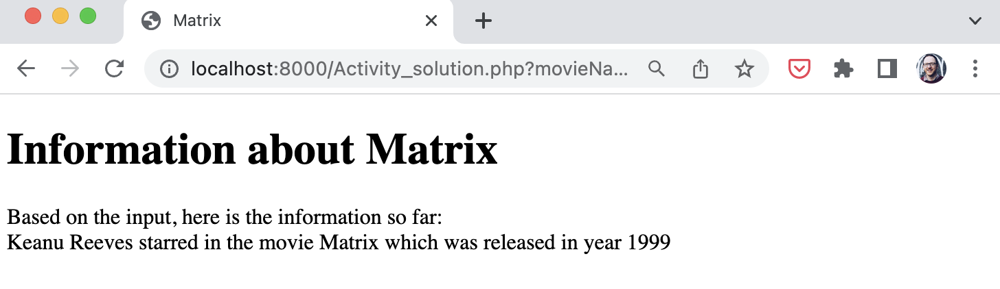

# Displaying Query Strings in the Browser

In this activity, we'll apply the knowledge gained from this section to retrieve query strings from a URL and print the relevant info to the browser.

You'll create a simple application that allows users to view ovie information in the browser. Once you have completed the activity, you should have an output similar to the following:

1. Create a file name `movies.php`
2. Capture query string data in the file to store the details of the movies, such as movie name, actor names and release year.
3. Create a basic HTML structure and then display the captured query string.
4. Go to the terminal and execute the command to start the built-in web server.
5. After the server is up and running, open the PHP page and append the relevant query strings.

There's a possible solution [here](./Activity_solution.php).